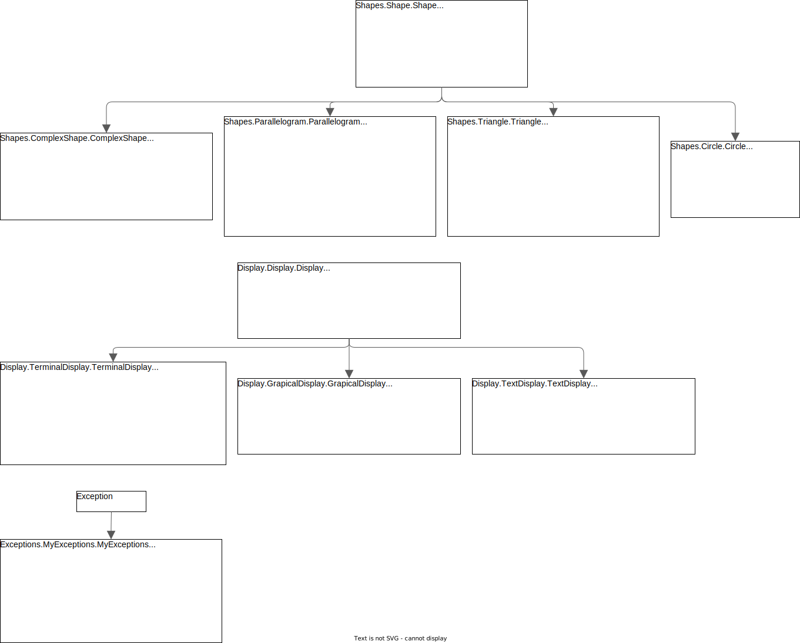

# Shapes Project 
## University assigment

## Table of contents
* [General info](#general-info)
* [Class Diagram](#class-diagram)
* [Technologies](#technologies)
* [Setup](#setup)

## General info
Topic no. 1 drawing shapes. It's a university assigment for programing methods.

## Class Diagram


## Technologies
Project is created with:
* Python 3.11
* matplotlib 3.7.1
* numpy 1.24.3

## Setup

```
$ pip install -r requirements
$ python main.py
```
